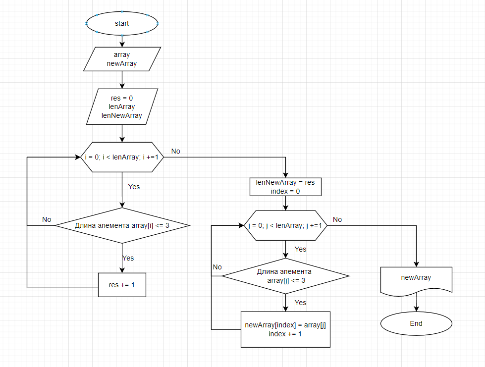

# Задача
Написать программу, которая из имеющегося массива строк формирует новый массив из строк, длина которых меньше, либо равна 3 символам. Первоначальный массив можно ввести с клавиатуры, либо задать на старте выполнения алгоритма. При решении не рекомендуется пользоваться коллекциями, лучше обойтись исключительно массивами.

# Вариант решения
1. Создаем исходный строковый массив
2. Создаем метод, для определения 
количества элементов, удовлетворяющих условиям. Метод возвращает число
3. Создаем новый массив, в качестве размера будет результат метода, из пункта 2
4. Создаем метод, для заполнения нового массива элементами, удовлетворяющими условиям
5. Выводим результирующий массив 
# Ссылка и скрин блок схемы с решением
* Ссылка - [Блок схема](https://app.diagrams.net/#G1W_pSHyTlLcMvOpt5wE-pyQ2pzLQV3uGB#%7B%22pageId%22%3A%22BDz6f1bbFMQQwcU9Wdew%22%7D)
* Скрин блок схемы

